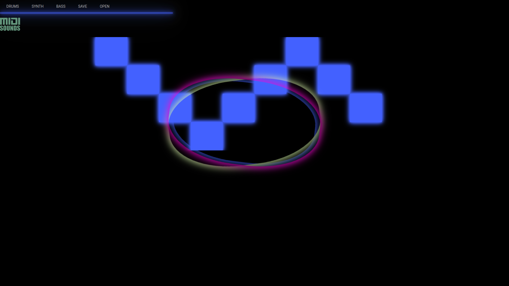

# MIDI Music Sequencer

- Mariana Pachon  
- Jeffrey Estrada  
- Fareya Ikram  

This website creates an audiovisual experience through the making of music on the Cm pentatonic blues scale on a grid, and the visualization of glowing elements. Users can create songs using three instruments: synth, bass, and drums. The idea was to create an intuitive yet "challenging" music making experience during which the user can discover new features of the website as they click around. 

The app can be accessed live here: https://fp-sequencer.herokuapp.com/

To run locally:
- `npm install`
- `npm start`

## Technical Achievements 
- Used React
- Created a matrix for music generation that triggers sound and its visualizations
- Data persistency: gave the user the chance to save a song and be able to access it in the future
- A lot of math to calculate proper timings and behaviors that would be used eventually to trigger sounds as well as visualizations:
	- Bitwise operations
	- Beats per minute calculations

## Design Achievements
- Created a futuristic/glowing theme throughout the entirety of the page
- Materialize was used, but most of the styling was done with pure CSS
- Attemped to pick futuristic sounds for audio and visuals to match and to be able to create a full audiovisual experience

## Ideas for future improvements
- Give users the option to reset their song as well as pick the bpm and key of the song
- Create better visuals to make the experience smoother
- Expand on the amount of sounds that can be selected
- Give users the ability to connect a physical MIDI controller 
- Use gibber.js to make better visualizations and make the page faster, as the library that was used got a bit slow sometimes