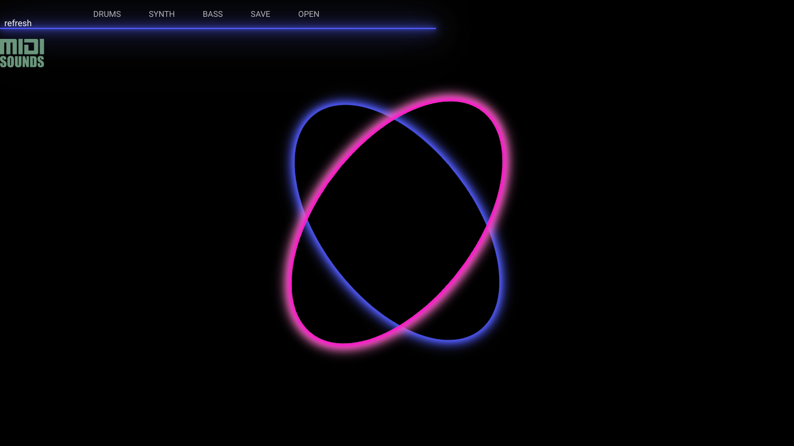

# teamname | Music Sequencer

- Mariana Pachon  
- Jeffrey Estrada  
- Fareya Ikram  

App can be accessed live here: https://fp-sequencer.herokuapp.com/

This app is a music making software that allows the user to experiment and explore with music. They can create different beats using the three options that we have provided for them: synth, bass, and drums. When the users start using the app, they will see a black screen with a menu on top. As the user clicks different components of the page, they will start generating music. They can explore different sounds by clicking different components of the grid. Once they gain experience, they can start creating more advanced beats. The music will be visualized differently depending on the music the user creates. The user can choose to save their music once they are done. 

