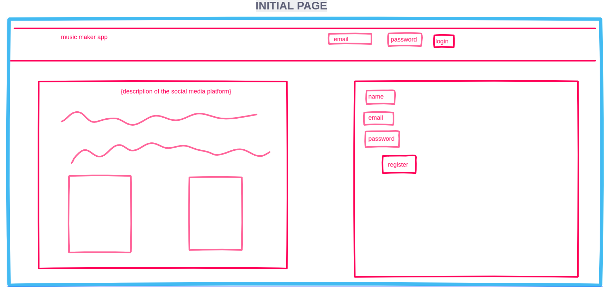

Collaborative Music Maker
===
Fareya Ikram and Mariana Pachon

The idea of this project is to create a collaborative social media based music production web application. Our goal is to make music making accessible to everyone, by offering a straight forward and easy to learn platform where users can create without the significant learning curve that some advanced music production softwares might cause. This platform gives the opportunity to many creative minds to come together and create a single piece, and it also allows people to start their own songs.

# Functionalities
- A user can login or register to the application:

- Once they are logged in, they can see all of the creations and collaborations from other users. 

- They have the option to start a new song or collaborate on a previously created song.
- In the case where the user wants to **create** a new song, a new screen pops up and shows a 4 bar sequencer to start making music. A sequencer is a visual matrix where each row corresponds to a sound and each column corresponds to a time in the overall song duration.
 
- The creator has the option to pick the tempo (bpm), key and title for the song. 
- The creator now picks what category of sounds they want: beat, bass, strings, synth or wind.
- The creator then clicks on a block to trigger a specific sound on a specific time. 
- In our prototype, the light pink line with the arrow at the bottom is a visual representation of the tempo that the song is at at all times. The line stops when the pause button is clicked and goes through the whole matrix horizontally and in loops when it is playing. It triggers any block that is clicked once it reaches that location.
- Once the user is satisfied with the creation, they can save their new track. This will now appear in all the other user's home page, and they can contribute.
- In the case where the user wants to **contribute** to a song, a similar screen pops up and shows the same sequencer. The only difference in this case is that they cannot change the tempo, key or title of the song. 

- See the actual invision prototype .

# Other similar ideas and how ours is different
- https://github.com/eacoeytaux/cs4241-fp
	- It is not collaborative
	- You can only use the pentatonic scale
- https://www.kompoz.com/music/
	- You cannot make the song on the platform, an external software such as Logic or Ableton Live have to be used to create the song and then it gets uploaded to the platform
- https://www.bandhub.com/
	- It focuses on audio , recording on top of other people’s sounds. Our app will only support midi and creation on the platform. 

# Technologies
- Frontend: React
- Server: Express
- Database: PostgreSQL
- Storing the midi files somehow

# Database Tables
- **Users:**

id | name | username      | email
------- | ---------------- | ---------- | ---------
8 	| mariana pachon | mpp | mpp@gmail.com
4	| fareya ikram	| fi | fi@gmail.com

- **Tracks:**

 sid (song id) | conid | tracknumber | midi 
------- | ---------------- | ---------- | ---------
 6 | 8 | 1 | path to the midi file location

 - `sid`: song id. All contributions to the same song will have the same `sid`
 - `conid`: contributor unique id
 - `tracknumber`: position in the song where this specific track goes. If this value is 1, then the original creator of the song is the user with the `conid` of this row.
 - `midi`: track to the midi file that is stored somwhere else

# Questions
- Is our idea doable in 2 weeks?
- Is our idea innovative enough for the scope of this project?
- Does the matrix creation seem too challenging? Should we maybe not give the option to change the tempo and key (this would reduce the amount of files), and maybe just give the option of having a minor and major scale?
- Is storing the path to the midi file a good idea, or would retrieving the actual file make everything really slow?
- Would you recommend a different structure for the tables, or are we on the right track?
